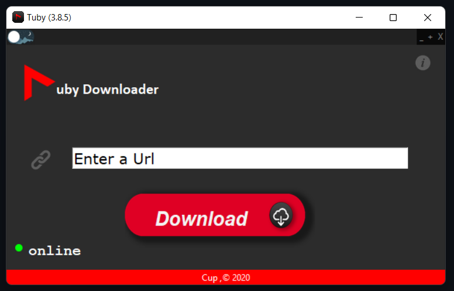
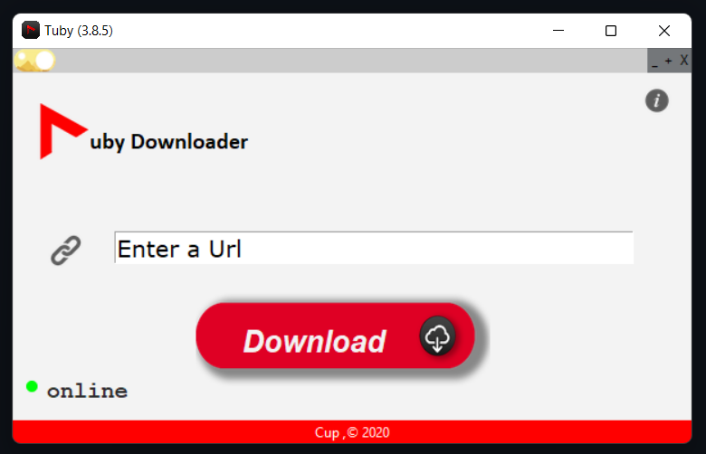
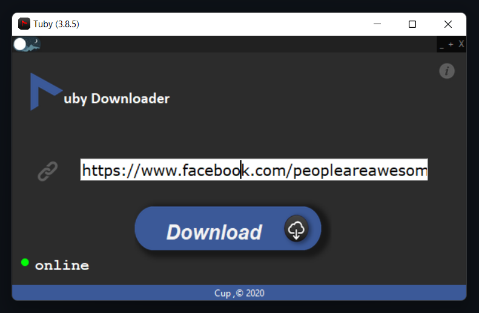

## Tuby

### Super Fast ⚡ . YouTube ▶️ . Downloader ⬇️  
#### If you have Doubt in it. Check it Out.
⚠ (The software and documentation is in development stage)\
Tuby is freeware and Open-Source Software written in python, which can download youtube videos at super fast ⚡. For now the software is in Initial Stage. It may take time to construct my entire Idea.
## Features
- Light-Weight 💨
- Super FAST 🔥
- Productive 🧲
- Easy Use UI 💻
___
## Installation

```
git clone https://github.com/guruprasadhj/Tuby
cd Tuby
pip install requirements.txt
pip install .
```
 ## Run the App 
 ### GUI :
 ```
 tuby-gui  
 ```
 ### CLI :
```
 tuby-cli
```
_____
## Dependency to Run Code

### Dark Theme :


### Light Theme :


### While pasting Fb Video :


_____

### packages
- python-3.x
- python-tk
- xsel or xclip
### Library
- pytube
- PIL(pillow)
- PyperClip
___
## Demo Pictures

## Contribute

Contributions are always welcome!\
Just Fork and Good to go....
😋  😊  😇
 
___
## License

[MIT](https://github.com/guruprasadhj/Tuby/blob/master/LICENSE)
___
